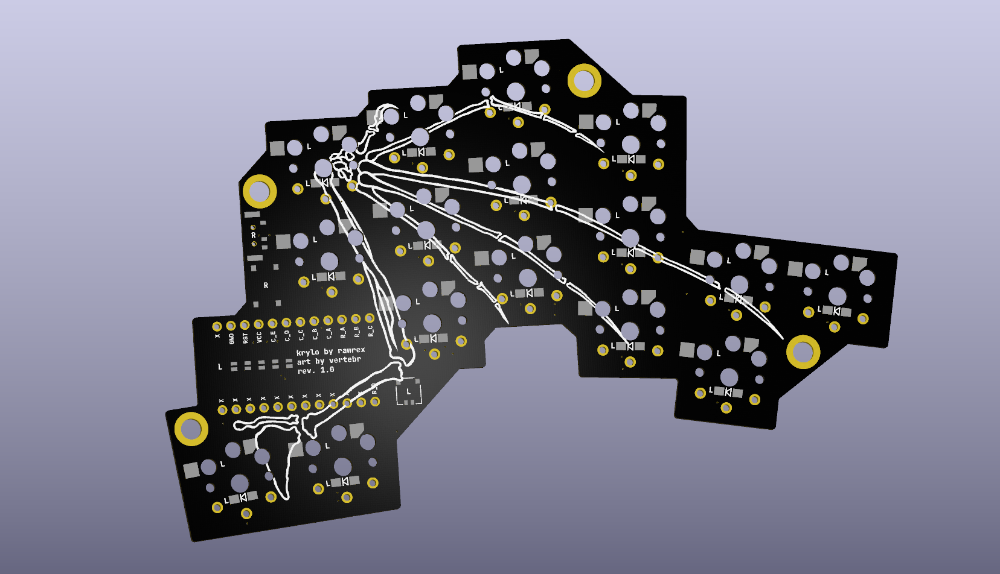

**Krylo** (*"wing"* in Russian) is a 32 key column-staggered split keyboard running [ZMK](https://zmk.dev/)

Core ideas that motivated the project:
- (My) pinky moves to the side better than it reaches forward to the upper row.
- (My) index finger is also able to move to the side, but it is not comfortable to move to the side and down.
- Single PCB symmetrical definition for both sides of the split.
